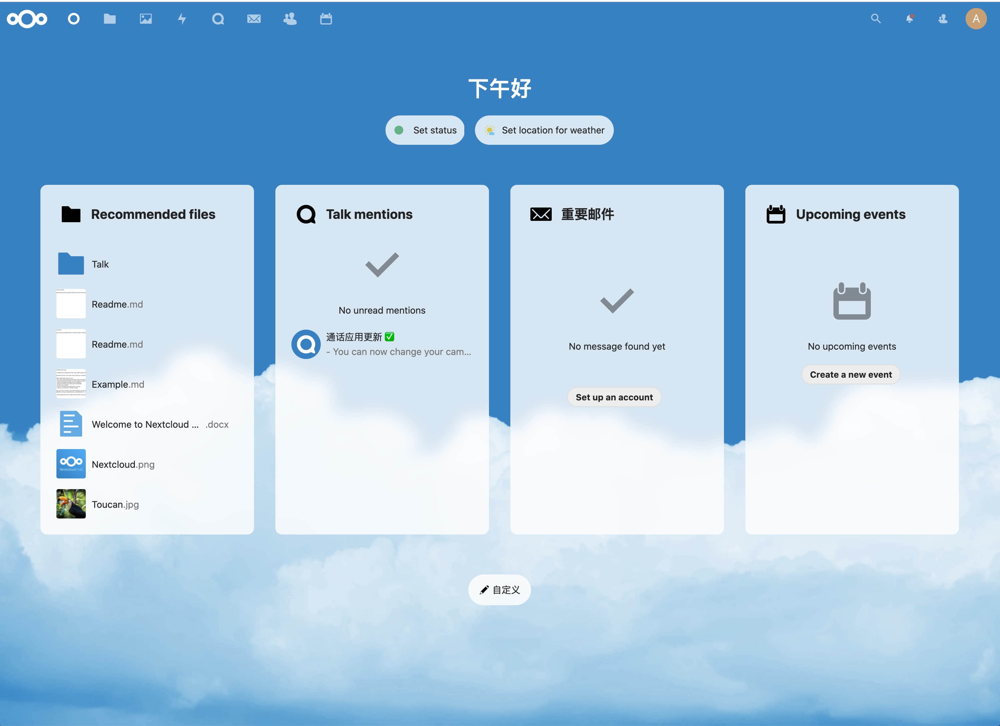
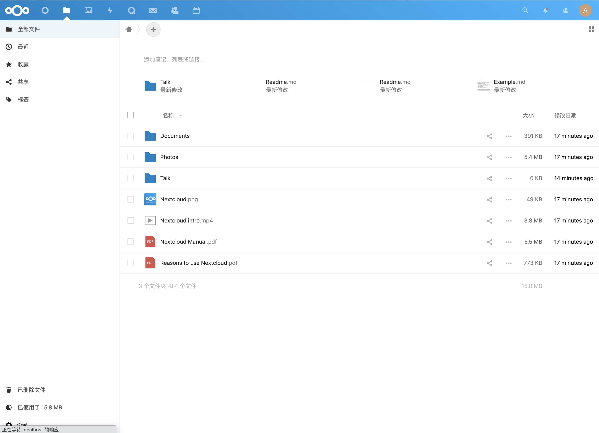

  

# [Nextcloud](https://github.com/nextcloud/server)

Nextcloud 是一套个人云存储解决方案，内置了图片相册、日历联系人、文件管理、RSS 阅读等丰富的应用。

## 部署

### 配置

- `MYSQL_DATABASE`：数据库名
- `MYSQL_USER`：用户名
- `MYSQL_PASSWORD`：密码
- `MYSQL_HOST`：地址

更多配置参考：https://github.com/nextcloud/docker

### 依赖

- CynosDB：使用 CynosDB 数据库存储数据
- CFS：使用 CFS 持久化存储数据

## 注意事项

1. 部署时，需要将服务路径设置为根路径 `/`
2. 建议使用 0.5C1G 以上的规格
